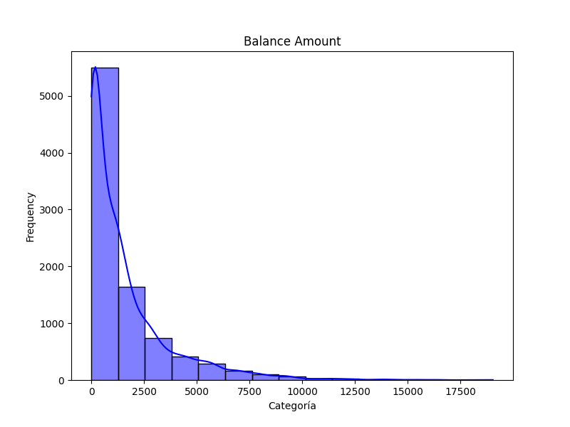
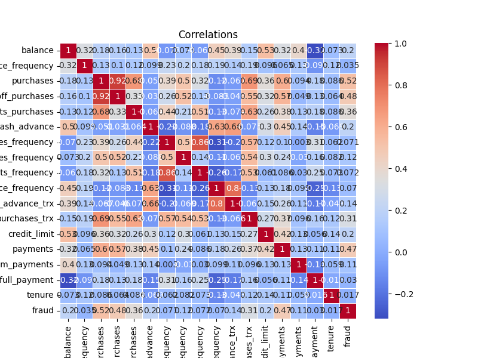

# Question 1
## Question 1.1
For this purpose we started reading the csv file using pandas libary. A function was defined in order to create a histogram of a numerical field of the dataframe.

## Question 1.2
For this part of the question i will comment on some findings of the data structure:
- There are important differences in the scale of the variables.
- There are 6 fields which have null values, two of them are the date fields wich is strange and could be a data source error. The credit limit field has some null values, this is interesting to me because i think that credit cards always assign a limit; I am assuming that asset-backed loans are not included here.
- This is a very unbalanced dataset. The percentage of fraud is 0.78%, data augmentation techiniques could be necessary.
- There is a correlation of 0.92 between purchases and oneoff_purchases, wich means that most customer purchases are sporadic. The correlation between purchases_frequency and purchases_installments_frequency is 0.86 wich means that most customer purchases are paid in installments.
- Finally, the fraud field (target) is more correlated with oneoff_purchases and to a lesser extent with payments, this reinforces the intuitive idea that customers with sporadic and large purchases can be riskier.

## Question 1.3
Again, a function is defined to group by year and month and calculate mean and median of the field balance per year/month. Only the necesary fields were used. The code for this question is Question1.py.

# Question 2
## Question 2.1
For this excersice i kept only the five necessary fields, we turn date fields to datetime type in order to extract the year of both dates and then select only the rows with year 2020 of activation and last payment. I also extracted the first letter of cust_id and modified activation_date to show only year and month. Finally, the calculated field is as shown in the code; the code for this question es Question2.py.

# Question 3
## Question 3.1
## Question 3.2